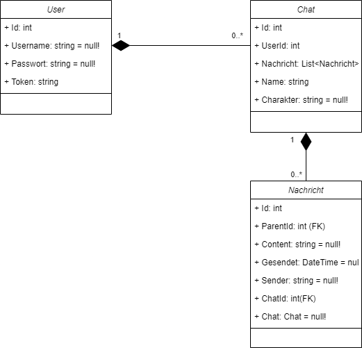
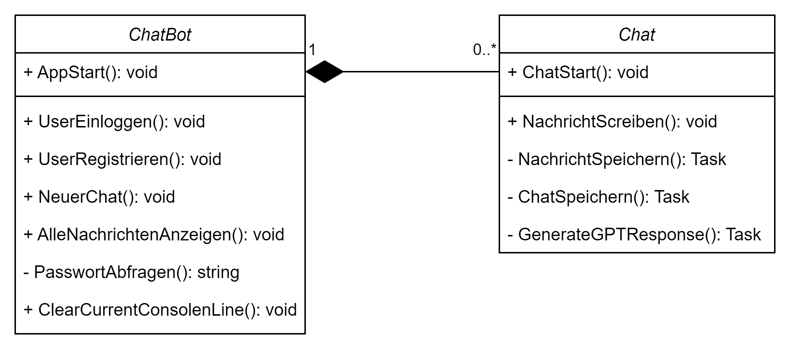

)

  

        
  

  
 
        <h1>🤖GSO ChatBot</h1>

**GSO ChatBot UML** 

    
    

### Beispiel Datensatz

**Users Tabelle**   
| Id | Username | Passwort | Token |
|----|----------|----------|-------|
| 1  |          |          |       | 

**Chats Tabelle**
| Id | UserId | Name | Charakter |
|----|--------|------|-----------|
| 1  |        |      |           |

**Nachrichten Tabelle**
| Id | ParenId | Content | Gesendet | Sender | ChatId |
|----|---------|---------|----------|--------|--------|
| 1  |         |         |          |        |        |
