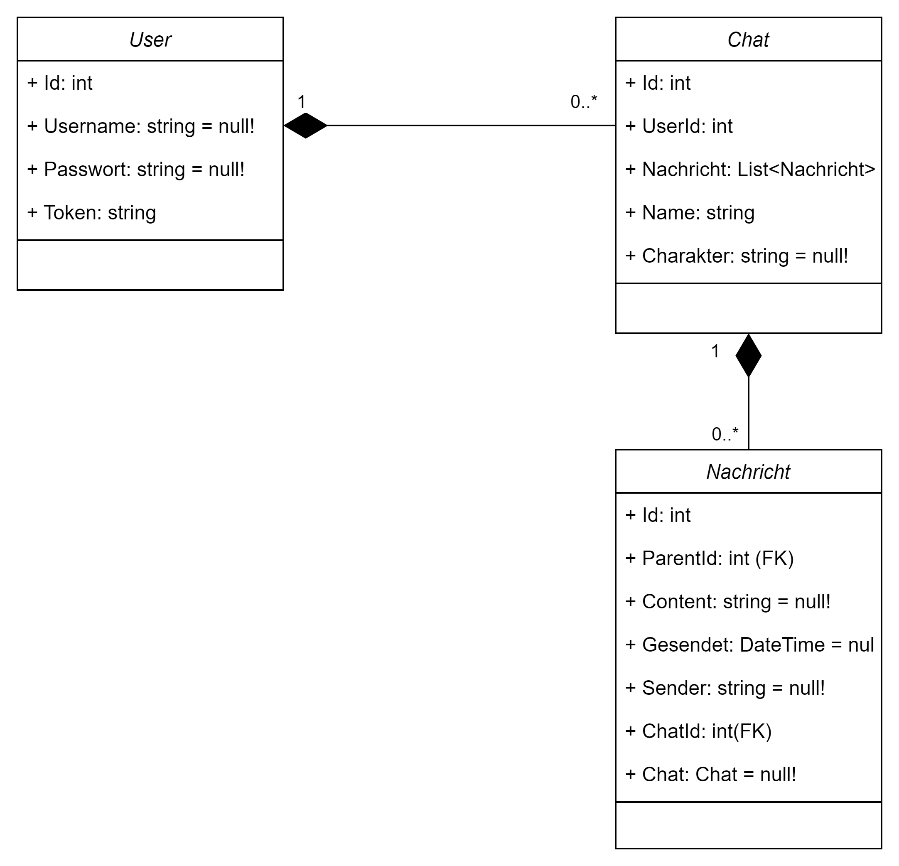

[]([https://classroom.github.com/a/V9X9SYfz](https://github.com/x10Lukas/GSO-ChatBot))
<div id="container" style="white-space:nowrap">

  <div id="image" style="display:inline float: right;">
        
  </div>

  <div id="texts" style="display:inline; white-space:nowrap; float: right;"> 
        <h1>🤖GSO ChatBot</h1>
</div>

**GSO ChatBot UML** 
<div style="display: flex; justify-content: space-between;">
    
    
</div>

### Beispiel Datensatz

**Users Tabelle**   
| Id | Username | Passwort | Token |
|----|----------|----------|-------|
| 1  |          |          |       | 

**Chats Tabelle**
| Id | UserId | Name | Charakter |
|----|--------|------|-----------|
| 1  |        |      |           |

**Nachrichten Tabelle**
| Id | ParenId | Content | Gesendet | Sender | ChatId |
|----|---------|---------|----------|--------|--------|
| 1  |         |         |          |        |        |


## :bookmark_tabs: Informationsquelle
Das Informationsmaterial zur Aufgabe finden Sie hier:   
[:dart: Entity Framework](./Referenzen/EntityFramwork.md)   
[:book: GSO-Wiki](https://github.com/GSO-SW/public_content_gso/wiki/Grundlagen-der-Sprache-C%23#25-kontrollstrukturen)

  
---
## 1. Installieren des Entity Framework :computer:
###  Installieren über das .NET command line interface (CLI)

#### 1. Öffnen Sie das Terminal in Ihrem Respository verzeichnis

Sie können Pakete auf Projekte Begrenz installieren indem das Verzeichnis zum Projekt Navigieren.   
```PS ...\csharp-entity-framework-A1-template-lehrkraft\Aufgabe1_GSOPizza>```   

#### 2. Installieren Sie die EF-Pakete

Installieren Sie der Reihe nach folgende Pakete indem Sie den Befehl in das Terminal eingeben:

**Entity Framework Core**
```
dotnet add package Microsoft.EntityFrameworkCore --version 6.0.0
```
**Entity Framework Core SQLite**
```
dotnet add package Microsoft.EntityFrameworkCore.Sqlite --version 6.0.0
```
**Entity Framework Core Design**
```
dotnet add package Microsoft.EntityFrameworkCore.Design --version 6.0.0
```
**Entity Framework Core Tools**
```
dotnet add package Microsoft.EntityFrameworkCore.Tools --version 6.0.0
```

**Entity Framework**
```
dotnet tool install --global dotnet-ef --version 6.0.0
```

###  Installieren über das Visual Studio graphical user interface (GUI)
#### 1. Öffnen Sie den NuGet-Paket Installer
Navigieren Sie im Projektmappenexplorer zum Entsprechenden Projekt und öffnen Sie den NuGet-Packet Installer mit einem Rechtsklick auf die Abhängigkeiten.   


#### 2. Installieren Sie die benötigten Pakete
Durchsuchen Sie den Installer nach den aufgelisteten Paketen. Installieren Sie jeweils die **Version 6.0.0**.
Folgende Pakete müssen installiert werden:   

- EntityFrameworkCore
- EntityFrameworkCore.Sqlite
- EntityFrameworkCore.Design
- EntityFrameworkCore.Tools
  
    
   
   
#### 3. Installierte Pakete bestätigen
   
Folgendes sollten Sie nun im Projektmappenexplorer sehen:       
   
    

---
## 2. Erstellen Sie die entsprechenden Klassen :memo:
Erstellen Sie die entsprechenden Klassen aus dem UML-Klassendiagramm. Erstellen Sie dafür eine neue Datei mit dem entsprechenden Namen(Bestellung.cs, Produkt.cs,...). Die Umsetzung wird an der Klasse **Bestellung** beispielhaft gezeigt:

```csharp

//Bestellung.cs

namespace Aufgabe1_GSOPizza
{
    internal class Bestellung
    {
        public int Id { get; set; }
        public DateTime Bestellt { get; set; }
        public int KundeId { get; set; }
        public Kunde Kunde { get; set; } = null!;
        public List<BestellungDetail> BestellungDetail { get; set; } = null!;
    }
}


```

---

## 3. Datenbank Kontext erstellen 🚧
Um die Datenbank mit dem Csharp-Code zu verbinden, müssen Sie eine Context-Datei erstellen. Erstellen Sie hierfür einen Ordner mit dem Namen **'Daten'** im Projekt GSOPizza. Erstellen Sie in diesem Ordner die Datei **'GSOPizzaContext.cs'**. Folgende abbildung zeigt den Resultierenden Pfad: 

```
Aufgabe1_GSOPizza
|
|-- Daten
|   |-- GSOPizzaContext.cs
|
|-- Kunde.cs
|-- Bestellung.cs
|-- BestellungDetail.cs
|-- Produkt.cs
|-- Program.cs
```

In dieser Datei wird nun der Kontext zur Datenbank hergestellt.   
**Vergessen Sie nicht den Pfad zu ihrer Datenbank im folgenden Code zu ändern**:

```csharp

//GSOPizzaContext.cs

using Microsoft.EntityFrameworkCore;

namespace Aufgabe1_GSOPizza.Daten
{
    // GSOPizzaContext Klasse erbt von DbContext, einem Teil des Entity Frameworks
    internal class GSOPizzaContext : DbContext
    {
        // DbSet-Eigenschaften repräsentieren Tabellen in der Datenbank
        // Jede Eigenschaft ist stark typisiert mit einer Modellklasse
        public DbSet<Kunde> Kunden { get; set; } = null!;
        public DbSet<Bestellung> Bestellungen { get; set; } = null!;
        public DbSet<Produkt> Produkte { get; set; } = null!;
        public DbSet<BestellungDetail> BestellungDetails { get; set; } = null!;

        // OnModelCreating-Methode wird verwendet, um das Modell und die Beziehungen mittels Fluent API zu konfigurieren
        protected override void OnModelCreating(ModelBuilder modelBuilder)
        {
            // Definieren von Primärschlüsseln für jede Entität
            modelBuilder.Entity<Kunde>().HasKey(k => k.Id);
            modelBuilder.Entity<Bestellung>().HasKey(b => b.Id);
            modelBuilder.Entity<Produkt>().HasKey(p => p.Id);
            modelBuilder.Entity<BestellungDetail>().HasKey(bd => bd.Id);

            // Immer die Basis-Methode aufrufen, um das Basisverhalten einzuschließen
            base.OnModelCreating(modelBuilder);
        }

        // OnConfiguring-Methode wird verwendet, um die Datenbankverbindung und andere Konfigurationen einzustellen
        protected override void OnConfiguring(DbContextOptionsBuilder optionsBuilder)
        {
            // Überprüfen, ob der optionsBuilder bereits konfiguriert ist, wenn nicht, konfigurieren
            if (!optionsBuilder.IsConfigured)
            {
                // Konfigurieren der Verwendung der SQLite-Datenbank mit dem angegebenen Verbindungsstring
                optionsBuilder.UseSqlite(@"Data Source=C:\Users\kande\source\repos\csharp-entity-framework-A1-template-lehrkraft\Aufgabe1_GSOPizza\gso_pizza.db");
            }

            // Immer die Basis-Methode aufrufen, um das Basisverhalten einzuschließen
            base.OnConfiguring(optionsBuilder);
        }
    }
}
```

---

## 4. Migration erstellen und migrieren 💾  
Die Konfigurationen zur Datenbank würden nun erfolgreich abgeschlossen. Damit das Entity-Framework die Datenbank erstellen kann, müssen die Konfigurationen in eine art Umsetzungsplan (Migration) umgewandelt werden. Diese wird wie folgt umgesetzt: 

### Migration

**Migration über dotnet CLI**   
Wenn Sie das Entity Framework Paket global installiert haben, steht Ihnen der Befehl **'ef'** in dotnet zur verfügung. Geben Sie folgenden Befehl in die Powershell ein um eine Migration zu erstellen:
```
dotnet ef migrations add InitialCreate
```


**Migration über Paket-Manager-Konsole**   

Navigieren sie über die Visual Studio Toolleiste   

> **Extras/Nuget-Pakte-Manager/Paket-Manager-Konsole**   


    

Geben Sie in Konsole folgenden Befehl ein:

```
PM> Add-Migration InitialCreate
```


### Migrieren
Um die erstellt Migration in eine Konkrete Datenbank umzuwandeln, muss die Migration angewendet werde. wieder stehen zwei verschiedene Umsetzungsmöglichkeiten zu Auswahl.

**Migrieren über dotnet CLI**   
```
dotnet ef database update
```

**Migration über Paket-Manager-Konsole**   
Geben Sie in Konsole folgenden Befehl ein:

```
PM> Update-Database
```

---

## 5. Daten Speichern und Auslesen :minidisc:
Nun wurde eine Datenbank in Ihrem Projekt erstellt und Sie sind startklar 😄.

**Aufgabe 1:** Gehen Sie nun in die Datei **Program.cs** und lesen Sie alle Daten aus der Beispieltabelle zu Beginn des Assignments ein. 
> ❗Hinweis: Nutzen Sie die Informationen us dem [GSO-Wiki](https://github.com/GSO-SW/public_content_gso/wiki/Entitiy-Framework)

**Aufgabe 2:** Erstellen Sie die Fehlenden Methoden zum anzeigen aller Tabellen der Datenbank nach der vorlage von **AlleKundenAnzeigen**.    
```csharp
await AlleBestellungenAnzeigen(dbContext);
await AlleProdukteAnzeigen(dbContext);
await AlleKundenAnzeigen(dbContext);
await AlleBestellungDetailsAnzeigen(dbContext);
```

Weche Bedeutung der Aufruf der Methode mit **await** und die definition des Methode als **async Task** hat können Sie im GSO-Wiki unter [Methoden](https://github.com/GSO-SW/public_content_gso/wiki/Methoden#asynchrone-methoden) nachlesen.   

```csharp
static async Task AlleBestellungenAnzeigen(GSOPizzaContext dbContext)
{
    var alleBestellungen = await dbContext.Bestellungen
                                          .Include(b => b.Kunde) // Includiert die Kundendaten
                                          .ToListAsync();
    Console.WriteLine("-----------------------------------------");
    Console.WriteLine("Alle Bestellungen:");
    foreach (var bestellung in alleBestellungen)
    {
        Console.WriteLine($"ID: {bestellung.Id}, Bestelldatum: {bestellung.Bestellt}, KundeID: {bestellung.KundeId}, KundenName: {bestellung.Kunde.Vorname} {bestellung.Kunde.Nachname}");
    }
}
```
---

## 6. Menü und voller Funktionsumfang für die GSO-Pizza :memo:

Erstellen Sie nun die GSO Pizza App. Hierfür soll eine neue Datei mir dem Namen **GSO_Pizza.cs** erstellt werden. In dieser Datei wird die App als objektorientiertes Programm umgesetzt. Folgendes UML-Klassendiagramm soll Ihnen bei der Strukturierung der App helfen.


Das Menü soll folgende Punkte und Unterpunkte enthalten:

```
Kunden verwalten
|--Kunden anlegen
|--Kunden löschen
|--Kunden bearbeiten
|--Kunden anzeigen

Produkt verwalten
|--Produkt anlegen
|--Produkt löschen
|--Produkt bearbeiten
|--Produkt anzeigen

Bestellung verwalten
|--Bestellung anlegen
|--Bestellung löschen
|--Bestellung bearbeiten
|--Bestellung anzeigen

```

Setzen Sie die App GSO-Pizza mitt all ihren Funktionen um. 

---
  
### Aufgabe 3: Arbeit einreichen

1. In Visual Studio 2022 das Fenster "Git-Änderungen" aufrufen
2. Eine kurze Beschreibung Ihrer Änderungen in die Textbox eingeben und "commit für alle" klicken
3. Mit dem Pfeil nach oben die Arbeit auf GitHub pushen.
4. Das Repository im Brower aufrufen und aktualisieren um die Änderungen zu bestätigen.
5. Im Pull-Request die Nachricht "Bereit zum Bewerten" hinterlassen, damit Ihre Lehrkraft weiss das Sie fertig sind.

---
